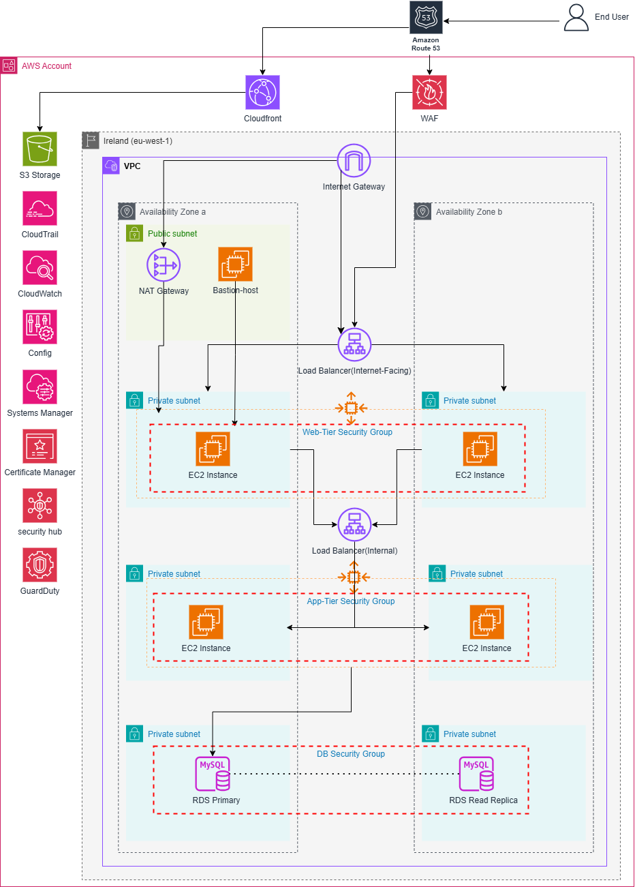

# 🏗️ AWS 3-Tier Architecture for Hosting a Scalable Web Application

This project demonstrates a **secure, scalable, and highly available 3-tier AWS infrastructure** to host a typical web application. The architecture separates the web, application, and database layers, and leverages various AWS services to meet production-grade performance, security, and reliability requirements.

---

## 📌 Architecture Overview

The infrastructure is deployed in **AWS Region: eu-west-1 (Ireland)** across **two Availability Zones** for high availability. It includes:

- A **Bastion Host** for secure access  
- A **public-facing Application Load Balancer (ALB)** to distribute external traffic to web-tier EC2 instances  
- An **internal Application Load Balancer** to decouple the web tier from the app tier  
- **App instances** in private subnets behind the internal ALB  
- **RDS Database (MySQL & Read Replica)** in isolated private subnets  
- **Auto Scaling Groups** for both tiers (Web & App) to ensure availability and elasticity  
- A combination of **public and private subnets**  
- **Routing, security groups, and NAT Gateway** to manage traffic and control access

---

## 🚀 Services & Rationale

| AWS Service | Purpose & Justification |
|-------------|-------------------------|
| **VPC (Virtual Private Cloud)** | Isolates and defines the network boundary. Enables fine-grained control over subnets, routing, and security. |
| **Public and Private Subnets** | Public subnet hosts the bastion and NAT gateway; private subnets host the web, app, and database tiers to restrict internet exposure. |
| **Bastion Host** | Used to securely SSH into internal instances. Only the Bastion SG is allowed SSH access to the Web/App SGs. |
| **Security Groups** | Controls traffic at the instance level: - Bastion SG allows SSH from trusted IPs only. - Web SG allows inbound HTTP(S) from the internet-facing ALB. - App SG only allows inbound from internal ALB. - DB SG only accepts traffic from App SG. |
| **Internet-Facing Load Balancer (ALB)** | Accepts incoming traffic and forwards it to the EC2 web-tier instances. Supports SSL termination with ACM. |
| **Internal Load Balancer (ALB)** | Sits between the web tier and app tier. Improves security and modularity by isolating internal communication. |
| **Auto Scaling Group** | Automatically manages EC2 instances across AZs for both web and app tiers. Maintains availability and scales with demand. |
| **NAT Gateway** | Enables private instances (e.g., app servers) to access the internet for software updates without exposing them. |
| **Internet Gateway** | Allows public-facing resources like the bastion host and external ALB to access the internet. |
| **Amazon RDS (MySQL)** | Managed relational database in private subnets with a **Read Replica** for read-heavy workloads and enhanced fault tolerance. |
| **CloudFront** | Speeds up content delivery by caching responses at global edge locations. |
| **AWS WAF** | Protects the application layer from common exploits such as SQL injection and XSS. |
| **Amazon Route 53** | Routes user traffic to the public ALB using a custom domain name. |
| **S3** | Stores static website assets, application artifacts, or backups. |
| **CloudWatch** | Provides logging, metrics, alarms, and dashboards for infrastructure monitoring. |
| **CloudTrail** | Audits AWS API calls to monitor changes and support governance. |
| **Config** | Tracks changes in configuration and checks compliance with defined policies. |
| **Systems Manager** | Manages EC2 fleet using Session Manager, Patch Manager, and Parameter Store. |
| **Certificate Manager** | Issues and manages SSL/TLS certificates for HTTPS access via ALBs. |
| **Security Hub & GuardDuty** | Centralizes security findings and detects potential threats. |

---

## 🔒 Security Highlights

- **No direct internet access** to app or database instances  
- **Internal ALB** isolates web and app tiers for improved security and decoupling  
- **Fine-grained security group rules** and subnet design enforce the principle of least privilege  
- **HTTPS encryption** via ACM-issued certificates at the external ALB  
- **EC2 instances in Auto Scaling Groups** automatically inherit correct SGs and subnet configs  
- **Auditing, compliance, and threat detection** via CloudTrail, AWS Config, GuardDuty, and Security Hub

---

## ⚙️ Deployment

> *Note: This infrastructure can be deployed using Terraform, AWS CloudFormation, or the AWS Management Console.*

---

## 📎 Future Enhancements

- Multi-AZ RDS with automatic failover  
- CI/CD pipeline to automate deployment

---

## 📫 Contact

For questions or improvements, feel free to reach out or open an issue.

---

**🛠️ Built with AWS best practices and security in mind.**
