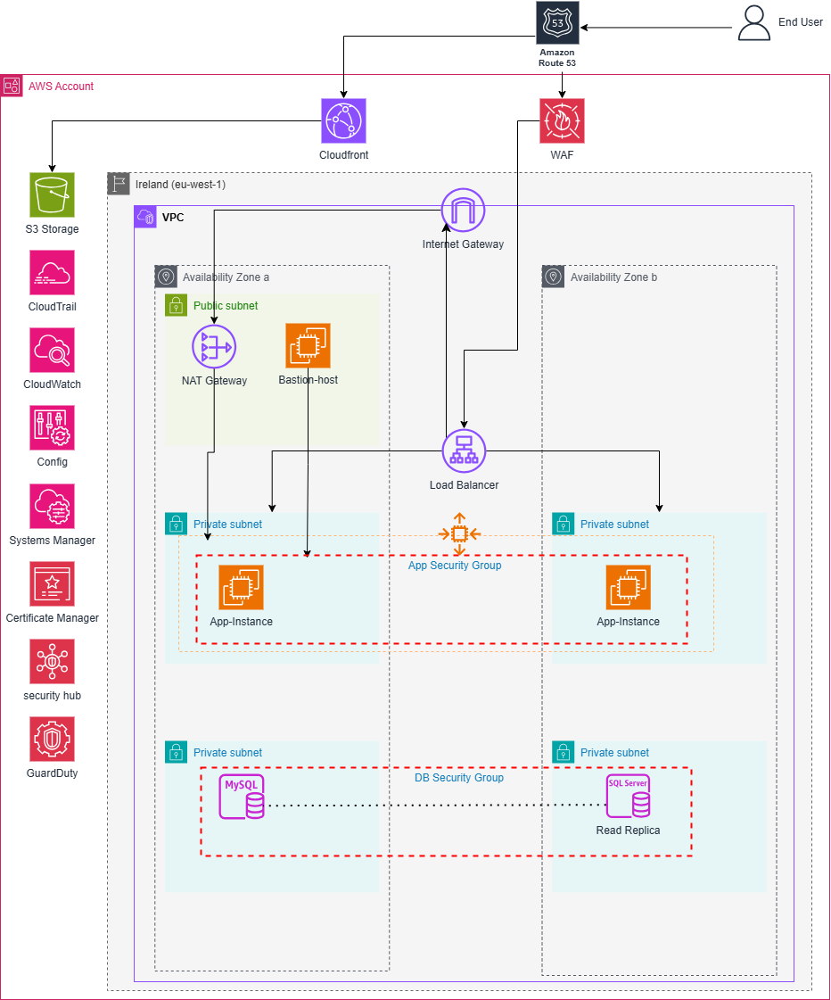

# 🏗️ AWS 2-Tier Architecture for Hosting a Scalable Web Application

This project demonstrates a **secure, scalable, and highly available 2-tier AWS infrastructure** to host a typical web application. The architecture separates the application and database layers and leverages various AWS services to meet production-grade performance, security, and reliability requirements.

---

## 📌 Architecture Overview

The infrastructure is deployed in **AWS Region: eu-west-1 (Ireland)** across **two Availability Zones** for high availability. It includes:

- A **Bastion Host** for secure access  
- **App Instances** behind a Load Balancer in private subnets  
- **RDS Database (MySQL & Read Replica)** in isolated private subnets  
- A combination of **public and private subnets**  
- **Routing, security groups, and NAT Gateway** to manage traffic and control access
- **Auto Scaling Group** manages the two EC2 instances (one per AZ) to ensure availability, distribute load, and recover from instance failure.

---

## 🚀 Services & Rationale

| AWS Service | Purpose & Justification |
|-------------|-------------------------|
| **VPC (Virtual Private Cloud)** | Isolates and defines the network boundary. Enables fine-grained control over subnets, routing, and security. |
| **Public and Private Subnets** | Public subnet hosts the bastion and NAT gateway; private subnets host application and database layers to restrict direct internet exposure. |
| **Bastion Host** | Used to securely SSH into the application instances. Only the Bastion SG is allowed SSH access to the App SG for enhanced security. |
| **Security Groups** | Controls traffic at the instance level: - Bastion SG allows SSH from trusted IPs only. - App SG allows inbound only from the Load Balancer and SSH from the Bastion SG. - DB SG only accepts traffic from App SG. |
| **Load Balancer (ALB)** | Distributes incoming application traffic across instances in different AZs to ensure high availability and better fault tolerance. |
| **NAT Gateway** | Enables instances in private subnets (e.g., app servers) to access the internet for updates or outbound requests without exposing them. |
| **Internet Gateway** | Allows public subnet components (e.g., Load Balancer, Bastion Host) to communicate with the internet. |
| **Amazon RDS (MySQL)** | Managed relational database service in private subnets with a **Read Replica** for read-heavy workloads or failover scenarios. |
| **CloudFront** | Speeds up delivery of static and dynamic web content by caching content at edge locations. |
| **AWS WAF** | Web Application Firewall that protects the application from common threats like SQL injection and cross-site scripting. |
| **Amazon Route 53** | Provides domain name resolution to route user traffic to the Load Balancer using a custom domain. |
| **S3** | Stores static assets or backups used by the application. |
| **CloudWatch** | Monitors infrastructure metrics, collects logs, and sets up alarms for operational visibility. |
| **CloudTrail** | Records API activity in the AWS environment for auditing and governance. |
| **Config** | Tracks configuration changes and compliance status of AWS resources. |
| **Systems Manager** | Helps manage instances using Session Manager (alternative to SSH), Patch Manager, and Parameter Store. |
| **Certificate Manager** | Issues and manages SSL/TLS certificates for HTTPS access via the Load Balancer. |
| **Security Hub & GuardDuty** | Detects security threats and provides a centralized view of security posture across the account. |
| **Auto Scaling Group	** | Automatically launches and manages EC2 instances across multiple Availability Zones. Ensures that the desired number of instances is always running. Helps handle variable traffic loads by scaling out/in based on demand. Works with the Load Balancer to distribute traffic evenly. |

---

## 🔒 Security Highlights

- **No direct internet access** to application or database instances  
- **Fine-grained SG rules** and subnet isolation for better access control  
- **WAF protection**, **CloudTrail auditing**, and **Config compliance tracking** implemented  
- **Encrypted traffic** using ACM-issued certificates with ALB + HTTPS
- **EC2 instances launched via Auto Scaling** Group inherit secure networking configurations and SG rules
- **Ensures resilience and fault tolerance** by automatically replacing unhealthy instances

---

## ⚙️ Deployment

> *Note: This infrastructure can be deployed using Terraform, AWS CloudFormation, or the AWS Management Console.*

---

## 📎 Future Enhancements
  
- Multi-AZ RDS with automatic failover  
- CI/CD pipeline integration

---

## 📫 Contact

For questions or improvements, feel free to reach out or open an issue.

---

**🛠️ Built with AWS best practices and security in mind.**
